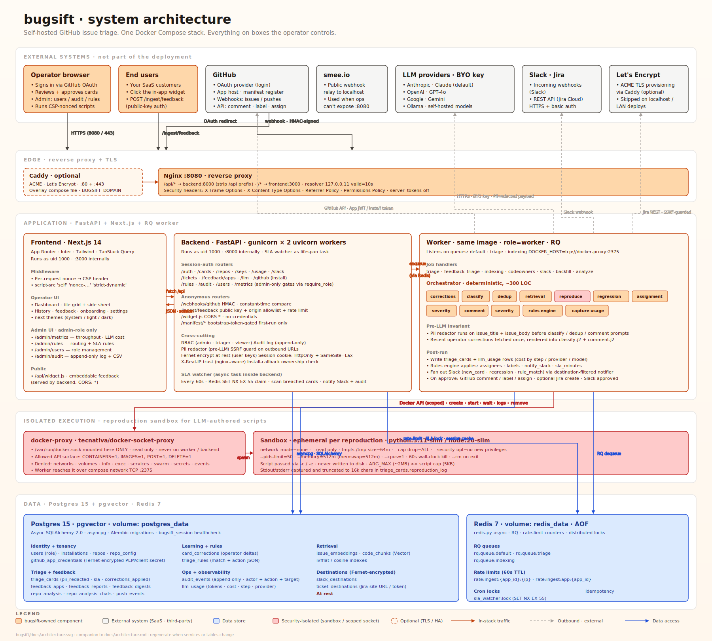

# Architecture

This document is the canonical source of truth for bugsift's architecture and
phased build plan. If any other doc disagrees, this one wins.

## One-line positioning

bugsift is the maintainer's triage agent for open-source GitHub repositories.
It does not write fixes. It classifies, deduplicates, reproduces, and routes
incoming issues so a maintainer's attention goes only to the issues that
actually need it.

## High-level diagram



Full SVG: [architecture.svg](./architecture.svg) — shows every service
in the compose stack, the security boundaries around the reproduction
sandbox, the data tables each component touches, and the outbound
integrations (LLM providers, GitHub API, Slack, Jira, Let's Encrypt).

A stripped text version for terminals that can't render SVG:

```
GitHub webhook
     │
     ▼
FastAPI backend ──► Redis queue ──► Worker process
     │                                   │
     ▼                                   ▼
 Postgres ◄───────── Triage pipeline ──► Docker sandbox (reproduction)
     ▲                                   │
     │                                   ▼
     └──────── Next.js dashboard ◄── LLM provider (user's key)
                      │
                      ▼
              GitHub API (post comment, apply labels)
```

## Locked tech choices

| Concern              | Choice                                 | Notes                                           |
|----------------------|----------------------------------------|-------------------------------------------------|
| Backend              | Python 3.11+, FastAPI, async throughout| Uvicorn dev; gunicorn+uvicorn workers in prod   |
| Job queue            | Redis + RQ                             | Not Celery. Simpler to debug.                   |
| Database             | Postgres 15+ with pgvector             | Vector search in the main DB.                   |
| ORM / migrations     | SQLAlchemy 2.0 async + Alembic         |                                                 |
| HTTP client          | httpx                                  | Used for GitHub and LLM providers.              |
| GitHub integration   | GitHub App                             | Installation tokens, signed webhooks.           |
| Reproduction sandbox | Docker, hardened per §5                | Python and Node.js supported in v1.             |
| Code chunking        | tree-sitter via `tree-sitter-languages`| Python, JS, TS, Go, Rust, Java AST-aware.       |
| Key encryption       | `cryptography.fernet`                  | Key from `BUGSIFT_ENCRYPTION_KEY` env var.      |
| Frontend             | Next.js 14 App Router, TypeScript      |                                                 |
| Frontend styling     | Tailwind + shadcn/ui                   |                                                 |
| Frontend data        | TanStack Query                         |                                                 |
| Backend tests        | pytest                                 |                                                 |
| Frontend tests       | Vitest                                 |                                                 |
| E2E                  | Playwright                             | One smoke test only in v1.                      |
| License              | Apache 2.0                             |                                                 |

## Non-goals (v1)

- No PR generation. No code fixes. No commits. Ever, in v1.
- GitHub only. No GitLab, Bitbucket, Gitea.
- No multi-channel ingestion. No Slack, Teams, email, web form intake.
- No chat interface.
- No hosted SaaS in v1. Self-hostable `docker-compose` stack only.
- No fine-tuning, no custom model training, no bundled embedding models.
- **No agent framework.** No LangChain, LangGraph, CrewAI. Custom orchestrator only.

## The triage pipeline

The orchestrator (`bugsift.agent.orchestrator`) runs a fixed, deterministic
sequence. Each step is an `async def step_name(state: TriageState) -> TriageState`.

1. **Ingest** — fetch body, comments, existing labels, author history.
2. **Classify** — one LLM call → `{bug, feature-request, question, docs, spam, other}` + confidence + rationale. Short-circuits on `spam` or low confidence.
3. **Dedup search** — embed title+body, cosine against open+closed issue embeddings (top 5 ≥ 0.75), LLM judge, short-circuit on confirmed duplicate.
4. **Codebase retrieval** — bug-only, no strong duplicate; cosine top 10 over code chunks, LLM picks 3–5.
5. **Reproduction** — bug + sufficient signal + supported language; LLM drafts a script, Docker sandbox runs it; verdict ∈ `{reproduced, not_reproduced, insufficient_info, unsupported_language, sandbox_error}`.
6. **Comment draft** — one LLM call combining everything into a triage comment + proposed labels + proposed action.
7. **Persist and maybe act** — write `triage_card`; if `auto` + action allowlisted, post to GitHub; else leave `pending`.

### Budget enforcement

Before every LLM call, the orchestrator checks the remaining monthly budget.
If exhausted: classification and comment-drafting still run (cheap); retrieval
and reproduction are skipped; the card is flagged `budget_limited=true`. Hard
cap: never exceed configured monthly budget by more than 10% in a single job.

## Reproduction sandbox (security-critical)

Every reproduction runs in an ephemeral Docker container with:

- Read-only root filesystem; only `/tmp` writable (tmpfs).
- All Linux capabilities dropped (`--cap-drop=ALL`).
- `--security-opt=no-new-privileges`.
- 60-second wall-clock timeout (hard kill).
- 512MB memory cap (with `memswap=memory` to prevent swap escape).
- 1 CPU (`cpu_period=100000, cpu_quota=100000`).
- 50-process limit.
- Ephemeral: container is `docker rm`'d after each run.

**v1 network posture:** the v1 sandbox uses Docker's default bridge network
so scripts can `pip install` or `npm install --global` a single dependency
at runtime. The project brief §5.5 calls for `--network none` plus a
whitelisted egress proxy (PyPI, npm only); that proxy is planned follow-up
work. Every other constraint in §5.5 is enforced today.

## Repo isolation

A repo's data is never included in prompts for any other repo. LLM calls
carry only the data relevant to the current job. Per-user API keys are
encrypted at rest with Fernet and never logged.

## Build order

1. **Phase 1 — Scaffolding.** Repo structure, docker-compose, empty FastAPI
   `/health`, empty Next.js `/dashboard`, Postgres + Redis wired, Alembic
   initialised, CI green. *(← we are here.)*
2. Phase 2 — Database and auth.
3. Phase 3 — GitHub App and webhooks.
4. Phase 4 — LLM provider abstraction.
5. Phase 5 — Classification and comment draft.
6. Phase 6 — Indexing and dedup.
7. Phase 7 — Codebase retrieval.
8. Phase 8 — Reproduction sandbox.
9. Phase 9 — Budget enforcement and usage tracking.
10. Phase 10 — Polish, docs, Playwright smoke test.

Do not skip phases. Each ends with a working, testable increment.
